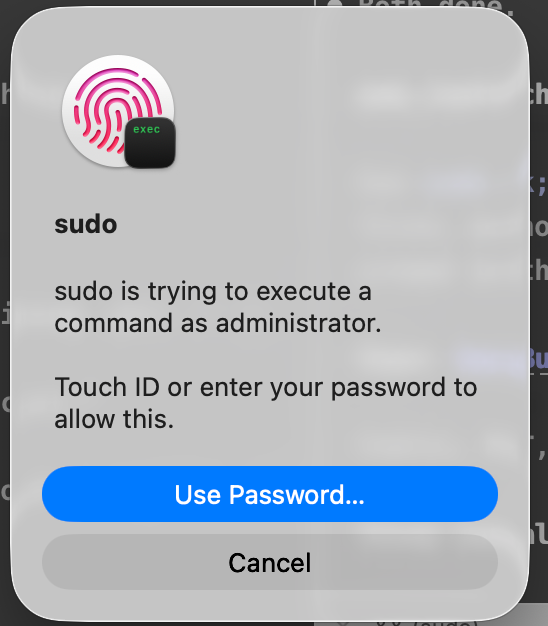

<p align="center">
  
</p>

# macos-touchid-sudo

Authenticate `sudo` with Touch ID instead of typing your password — including inside **tmux**.

[**Product page → abd3lraouf.dev/work/touch-id-for-sudo**](https://abd3lraouf.dev/work/touch-id-for-sudo/)

<p align="center">
  
</p>

<p align="center"><em>What you get instead of a password prompt. Touch the sensor, or fall back to your password.</em></p>

```console
$ sudo touchid-sudo
Wrote /etc/pam.d/sudo_local:
  # sudo_local: local config file which survives system update and is included for sudo
  # managed by touchid-sudo
  auth       optional       /opt/homebrew/lib/pam/pam_reattach.so
  auth       sufficient     pam_tid.so
```

macOS has shipped the `pam_tid.so` module for years, and since Sonoma there is a supported place to enable it that survives system updates. The catch is that turning it on means editing a file in the authentication path of `sudo` — the one command you need in order to fix a mistake. This tool does that edit carefully: it checks the machine first, backs up what was there, validates the resulting PAM stack, and **automatically reverts if validation fails**, so a bad edit can't leave you unable to run `sudo`.

## Requirements

- macOS 14 (Sonoma) or later — earlier versions have no `/etc/pam.d/sudo_local`
- A Mac with Touch ID, with at least one fingerprint enrolled
- [`pam-reattach`](https://github.com/fabianishere/pam_reattach) *(optional)* — required only for Touch ID inside tmux/screen

## Install

**Homebrew** (recommended):

```bash
brew install abd3lraouf-studios/tap/macos-touchid-sudo
sudo touchid-sudo
```

**One-liner** — detects your machine, offers `pam-reattach` if you use tmux, and can run the setup for you:

```bash
curl -fsSL https://raw.githubusercontent.com/abd3lraouf-studios/macos-touchid-sudo/main/install.sh | bash
```

**From source**:

```bash
git clone https://github.com/abd3lraouf-studios/macos-touchid-sudo.git
cd macos-touchid-sudo
make install
sudo touchid-sudo
```

Piping a script from the internet into `bash` deserves scrutiny. Read [`install.sh`](install.sh) first — it is short, and it downloads exactly one file: [`bin/touchid-sudo`](bin/touchid-sudo).

## Usage

```
sudo touchid-sudo             enable Touch ID for sudo
sudo touchid-sudo --disable   revert to password-only
     touchid-sudo --status    show current state (no root needed)
     touchid-sudo --version   print version
     touchid-sudo --help      usage
```

```console
$ touchid-sudo --status
Touch ID for sudo
  state:       ENABLED
  tmux/screen: supported (pam_reattach active)
  config:      /etc/pam.d/sudo_local
    | # sudo_local: local config file which survives system update and is included for sudo
    | # managed by touchid-sudo
    | auth       optional       /opt/homebrew/lib/pam/pam_reattach.so
    | auth       sufficient     pam_tid.so
```

Running it twice is a no-op — it reports `Already configured` and changes nothing.

## Touch ID inside tmux

Inside tmux or screen, `sudo` is not attached to your GUI session, so `pam_tid` has nowhere to draw its prompt and silently falls back to your password. [`pam_reattach`](https://github.com/fabianishere/pam_reattach) fixes that by reattaching the process to the user's session:

```bash
brew install pam-reattach
sudo touchid-sudo          # detects the module and wires it in
```

The module is written as `optional` and ordered **above** `pam_tid.so`. `optional` matters: if a future Homebrew upgrade moves or breaks the module, authentication degrades to your password instead of locking you out.

## How it works

`/etc/pam.d/sudo` ships with `auth include sudo_local` on its first line, so anything in `/etc/pam.d/sudo_local` is consulted before the usual password check. That file is not managed by macOS and survives system updates — unlike `/etc/pam.d/sudo` itself, which updates overwrite. This tool only ever writes `sudo_local`, and refuses to run if the include line is missing rather than hand-editing `/etc/pam.d/sudo`.

`pam_tid.so` is added as `sufficient`, meaning a successful fingerprint satisfies authentication while a failure *falls through* to your password. Touch ID being unavailable — over SSH, with the lid closed, on a Mac without a sensor — costs you nothing.

Safety measures on every run:

| | |
|---|---|
| **Preflight** | macOS, Sonoma-or-later include line, `pam_tid.so` present, fingerprint enrolled |
| **Backup** | previous config saved to `/etc/pam.d/sudo_local.bak` |
| **Validation** | runs `sudo -n` as you afterwards and inspects the result for PAM errors |
| **Rollback** | restores the backup automatically if validation fails, and exits non-zero |
| **Idempotent** | re-running changes nothing; unrelated lines in `sudo_local` are preserved |

## Uninstall

```bash
sudo touchid-sudo --disable   # revert to password-only
brew uninstall macos-touchid-sudo
```

or, from a source checkout, `make uninstall` (disables, then removes the command).

Disabling removes `/etc/pam.d/sudo_local` entirely rather than leaving an inert stub — back to factory state. Any lines you added yourself are kept, and the file is left in place if it still has content.

## Troubleshooting

**Touch ID doesn't prompt, it asks for my password.** Check `touchid-sudo --status`. If it reports `ENABLED`, confirm a fingerprint is enrolled (`bioutil -c` should report at least one template). Inside tmux, see the tmux section above.

**It works in Terminal but not in VS Code / JetBrains.** Those run `sudo` in an embedded terminal that may not be attached to your GUI session; `pam-reattach` fixes this case too.

**I broke my PAM config another way and `sudo` won't run.** Boot to Recovery (hold the power button), open Terminal, and delete `/Volumes/Macintosh HD/etc/pam.d/sudo_local`. This tool's own rollback should prevent ever needing that.

**Does this weaken security?** `sudo` still requires local presence and a biometric match, and falls back to your password rather than around it. The meaningful change is that a `sudo` prompt no longer traverses your keyboard, which removes one keylogger surface. Anyone who can already run code as you is not stopped by either mechanism.

## Development

```bash
make test    # 22 assertions, no root, nothing under /etc is touched
make lint    # shellcheck
```

The suite runs the real script against fixture files via `TOUCHID_SUDO_*` environment hooks, covering enable, idempotency, disable, line preservation, unsupported systems, and the rollback path. See [CONTRIBUTING.md](CONTRIBUTING.md).

## Press & marketing assets

Icons and the prompt screenshot live in [`art/`](art/), with the canonical product record — naming, boilerplate and indexed image dimensions — in [`art/assets.json`](art/assets.json). Product page: [abd3lraouf.dev/work/touch-id-for-sudo](https://abd3lraouf.dev/work/touch-id-for-sudo/).

## License

MIT — see [LICENSE](LICENSE).
